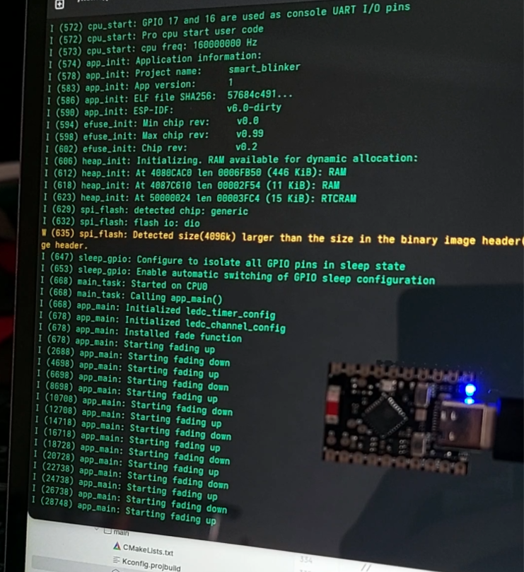
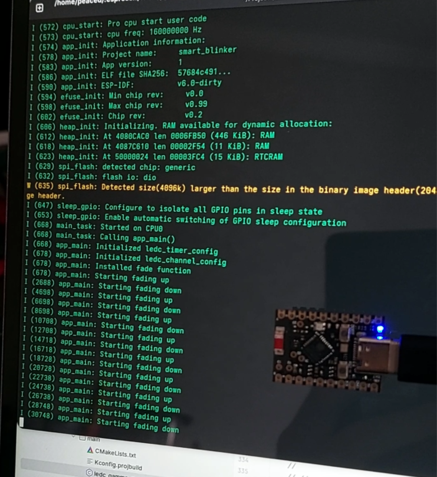
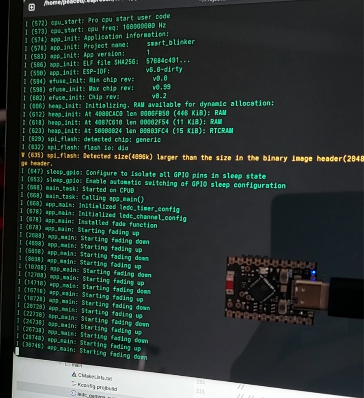
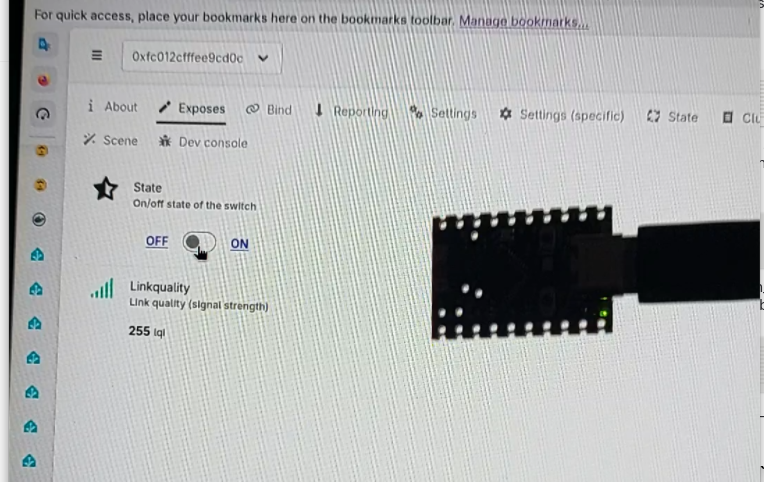
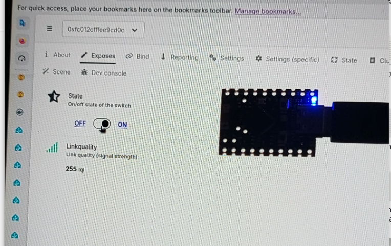

# `smart-light`

A simple Zigbee 3.0 smart light built on ESP-IDF, controllable via Home Assistant. Made for learning IoT and embedded development — nothing fancy, just a working bulb you can turn on and off from your phone.

## Hardware

- **Board:** `esp32c6-super-mini board`
- **Light:** `LED`
- **Power:** `USB-C`
- **Coordinator** `Sonoff Dongle-E`

## Stack

- ESP-IDF `v6.0`
- Zigbee SDK `esp-zigbee-sdk`
- Home Assistant `2026.6.4` with ZHA or Z2M

## Getting Started

### Prerequisites

```bash
# Install ESP-IDF
. $IDF_PATH/export.sh
```

Make sure your Zigbee coordinator is paired and running in Home Assistant before flashing.

### Build & Flash

```bash
idf.py set-target esp32c6    # or your target chip
idf.py menuconfig            # optional, adjust Zigbee channel etc.
idf.py build flash monitor
```

### Pairing

1. Power on the device — it starts in pairing mode automatically
2. In Home Assistant, open ZHA / Z2M and start device discovery
3. The light should appear within a few seconds
4. Done

## What it does

- Joins a Zigbee 3.0 network as an end device
- Exposes an On/Off cluster (and optionally a Level Control cluster)
- Home Assistant picks it up as a standard light entity

## Results

<details>
<summary>Photos</summary>







</details>

## Notes

This is a study project. The code is kept as simple as possible — error handling is minimal, device is factory new after each reboot and there is no OTA update support. If you are looking for production-ready Zigbee firmware, this is not it.

## License

You can do all you want because it is licensed under [MIT](LICENSE) license.